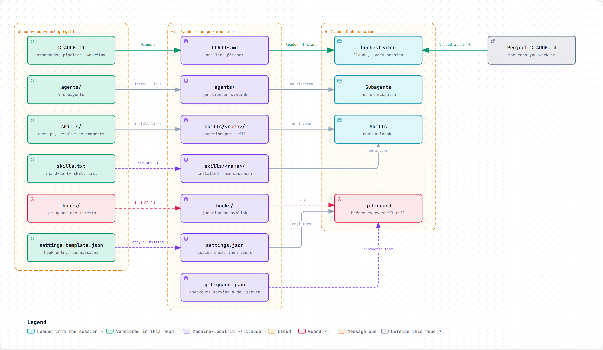
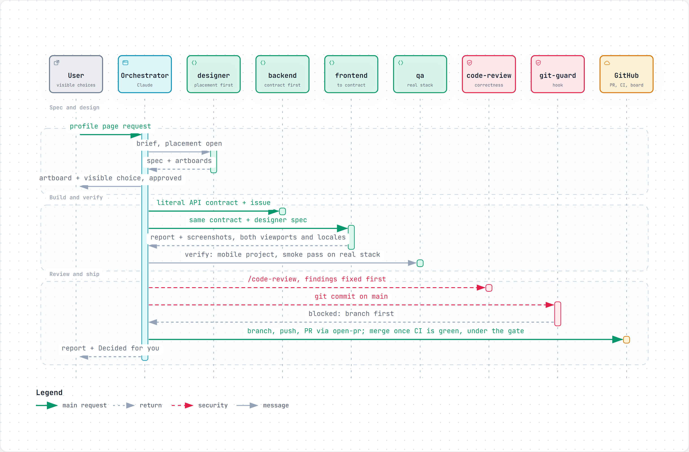

# claude-code-config

My global [Claude Code](https://claude.com/claude-code) setup: engineering standards, subagents, skills and hooks. It lives in a repo so a new machine gets it in a couple of commands, and so changes to how Claude works go through a reviewed PR like any other code.

It's opinionated: a specific stack (Next.js, Astro, Fastify, MongoDB, BullMQ, Flutter, Cloudflare), trunk-based development, and Airbnb as the UX reference. If you want to borrow it, fork it and change `CLAUDE.md` to match how you work. See [Using it yourself](#using-it-yourself).

## How it works

There is one copy of the config, and it's this repo. The install script points `~/.claude` at it, and a session reads from `~/.claude` as it always does:

<picture>
  <source media="(prefers-color-scheme: dark)" srcset="docs/diagrams/setup-dark.png">
  
</picture>

*Interactive version: [`docs/diagrams/setup.html`](docs/diagrams/setup.html), open the raw file in a browser. Source: [`docs/diagrams/setup.architecture.json`](docs/diagrams/setup.architecture.json), rendered with the `archify` skill and captured by `docs/diagrams/capture.mjs`.*

| `~/.claude/…` | Comes from | How |
| --- | --- | --- |
| `CLAUDE.md` | `CLAUDE.md` | a one-line `@` import |
| `agents/` | `agents/` | junction (Windows) / symlink |
| `hooks/` | `hooks/` | junction / symlink |
| `skills/<name>/` for skills written here | `skills/<name>/` | one junction / symlink per skill |
| `skills/<name>/` for third-party skills | `skills.txt` | installed from upstream with [`npx skills`](https://github.com/vercel-labs/skills) |
| `settings.json` | `settings.template.json` | **copied**, only when missing; after that it's yours |
| `git-guard.json` | you | machine-local list of checkouts that serve a dev server |

Edit a file through either path and you edit the same file. Nothing needs syncing; it just needs committing. Third-party skills aren't vendored, so they never go stale here and their licenses stay with their authors.

## A feature, end to end

What the pieces do together. The example is real: a profile that describes the user to the product was first put under Settings because that was the existing hub, needed two disclaimers to explain itself, and moved to its own page a week later. The `designer` rules and the "visible choices go to the user" rule in `CLAUDE.md` came out of it.

<picture>
  <source media="(prefers-color-scheme: dark)" srcset="docs/diagrams/feature-pipeline-dark.png">
  
</picture>

*Interactive version: [`docs/diagrams/feature-pipeline.html`](docs/diagrams/feature-pipeline.html), open the raw file in a browser. Source: [`docs/diagrams/feature-pipeline.sequence.json`](docs/diagrams/feature-pipeline.sequence.json), rendered with the `archify` skill and captured by `docs/diagrams/capture.mjs`.*

Where each step leaves its knowledge, so the next session can pick it up cold:

| Message | Produces | Lands in |
| --- | --- | --- |
| the request arrives | the real spec: scope in/out, acceptance criteria, contract if it crosses a service | the GitHub issue, enriched before dispatch |
| spec + artboards | placement decision with alternatives; artboards at 390/768/1280 | the project's design canvas; an ADR when it changes a pattern |
| contract, build, verify | code in a feature folder with its `feature_readme.md`; screenshots at both viewports and locales | the repo; the PR |
| /code-review | findings fixed before the PR is called ready | the PR |
| git commit on main | a blocked command and the reason | nowhere; it's just prevented |
| report + Decided for you | what was built, deferred, and decided on the user's behalf | the issue (retrofitted), ADRs, the final report |

Three things make this hold up over many sessions. Every subagent ends with the same four-section report, so the orchestrator re-checks claims instead of trusting them. Rules that can be mechanical are mechanical: the hook, lint with size and boundary rules, CI. And the repo is the memory: nothing decided on the user's behalf exists only in chat.

## Every agent, once

The pipeline skips the stages that don't apply, and the profile move needed four of the nine agents: no infra changed and nothing new faced outside input. A slice that needs all nine is a public landing page for the product: a new repo on Cloudflare, legal texts, a redirect that reads a query string, and an experiment behind it in the app. Also real; the brief and the ADR that answers it live in the product's own repos.

<picture>
  <source media="(prefers-color-scheme: dark)" srcset="docs/diagrams/landing-page-dark.png">
  
</picture>

*Interactive version: [`docs/diagrams/landing-page.html`](docs/diagrams/landing-page.html), open the raw file in a browser. Source: [`docs/diagrams/landing-page.sequence.json`](docs/diagrams/landing-page.sequence.json).*

What the five agents missing from the shorter example add:

| Agent | Brought in because | Leaves behind |
| --- | --- | --- |
| `product-strategist` | a new surface with its own audience and promise, not a feature on an existing screen | a proposal: scope, what the page must say and in what order, handoffs for the technical calls; the user accepts it before anything is designed |
| `architect-engineer` | the handoffs span repos and hosts (a Worker at the apex, web and bff on one host, first-party counts with no cookie) | one ADR with the alternatives, plus a slice plan with one owner per slice |
| `devops-engineer` | a Cloudflare Worker, deploy and preview workflows, DNS once the domain exists | the config, not the topology: the ADR fixed the hosts |
| `technical-writer` | public legal texts in two languages, and docs for running the new repo | drafts from the ADR's disclosure list, which security reviews and a lawyer reads |
| `security-engineer` | headers and CSP, a redirect, sign-up attribution, a rate-limited experiment, the legal texts | findings fixed before the PR, and the calls that are its own: the terms line, whether acceptance is stored |

The same rules hold at this size. The user saw two things before they were built, the proposal and the artboards; every other call went into the ADR. Each agent reported the same four sections. And the launch checklist lives in the feature doc, so a session months later can pick it up.

## What's in here

### `CLAUDE.md`: global standards

These load into every session. Default stack and how to choose within it; design defaults (mobile-first for apps, desktop-led for marketing pages, Airbnb as the UX reference, placement before polish, tokens and shared primitives); code principles and the checkable structure rules; feature folders with a `feature_readme.md`; testing, including that a fake for a boundary is validated against the real one; the subagent roster and the feature pipeline; trunk-based workflow and the merge gate; task tracking; knowledge (the repo is the memory, and the cold-start check); feature flags; CodeGraph.

Stack-specific conventions (Next.js, Fastify, Docker…) live in the agent that implements that stack, so they load only when that agent runs. A rule that lint or a hook can enforce is enforced there and not restated in prose.

### `agents/`: subagents

| Agent | Model | Use it for |
| --- | --- | --- |
| `product-strategist` | opus | Turning a raw product idea into scope, users, priorities and a phased roadmap. No tech opinions. |
| `architect-engineer` | opus | Boundaries and topology (BFF vs direct, new service vs extend, queue vs sync), short ADRs. |
| `designer` | opus | Where a feature belongs, new components and UX patterns, design tokens. Airbnb as the UX reference. |
| `frontend-engineer` | sonnet | Next.js/React, Astro and Flutter implementation; the stack architecture comes from the `*-architecture` skills. |
| `backend-engineer` | sonnet | Fastify BFFs/APIs, MongoDB repositories, BullMQ workers; the stack architecture comes from `fastify-architecture`. |
| `qa-engineer` | sonnet | Test strategy and verification: Playwright (web) or `integration_test` (Flutter) at desktop and ~390px, every shipped locale, a smoke pass on the real stack for cross-service changes. |
| `security-engineer` | opus | Security review and threat modelling across the stack. |
| `technical-writer` | sonnet | READMEs, API docs, ADRs, changelogs. |
| `devops-engineer` | sonnet | Docker/Compose, CI/CD, Cloudflare configuration. |

Each one ends with the same report shape (changed, verified, deviations, needs the user). The order they run in is the feature pipeline in `CLAUDE.md`. The model column is a family alias, so it follows that family's latest release; `node --test tests/agents.test.mjs` checks that every agent names one. The Subagents section of `CLAUDE.md` says what each tier is for and how to move a single dispatch up or down.

### `hooks/`: things Claude cannot forget

| Hook | Event | What it does |
| --- | --- | --- |
| `git-guard.mjs` | `PreToolUse` on `Bash` and `PowerShell` | Refuses a commit, merge, rebase, cherry-pick or revert on trunk, a push straight to trunk, a force-push to or deletion of it, `--no-verify` (and config overrides that disable hooks or signing), and a branch switch in any checkout listed in `~/.claude/git-guard.json` (one that serves a running dev server; use a worktree). Follows `cd` and `git -C` inside a compound command, including Git Bash paths on Windows. Blocks with the reason, so Claude branches or opens a PR instead. Any error inside the hook fails open. |

`node --test hooks/git-guard.test.mjs` runs its tests. The hook needs Node and `git` on `PATH`.

`~/.claude/git-guard.json` is yours and stays out of git:

```json
{ "protectedCheckouts": ["C:/Users/me/Projects/my-app"] }
```

### Skills

Written here, in `skills/`:

| Skill | What it does |
| --- | --- |
| `flutter-architecture` | The Flutter architecture: layers and the dependency table, feature folders with a composition-root Feature class, ports and adapters, sealed states, toggles, theme and page shell, i18n, tests, anti-patterns, and the review checklist. Loaded before any Dart code. |
| `nextjs-architecture` | The same for Next.js and Astro: feature `lib/` ports, Server Components, route-group chrome, tokens and primitives, Playwright at two viewports. |
| `fastify-architecture` | The same for Fastify APIs, BFFs, MongoDB and BullMQ: layering, schemas, typed errors, narrow ports, idempotent jobs. |
| `open-pr` | Opens a PR the trunk-based way: checks the branch, runs local checks, writes the description, creates it with `gh`. Pushes without asking where the project grants merge rights. |
| `resolve-pr-comments` | Triages unresolved review comments, fixes them, replies and resolves threads, asking before posting. |

Installed from upstream, listed in `skills.txt`:

| Skill | Source | What it does |
| --- | --- | --- |
| `conventional-commit` | [github/awesome-copilot](https://github.com/github/awesome-copilot) | Conventional Commits messages. |
| `clean-code` | [sickn33/antigravity-awesome-skills](https://github.com/sickn33/antigravity-awesome-skills) | Clean Code refactoring pass. |
| `frontend-design` | [anthropics/skills](https://github.com/anthropics/skills) | Distinctive, production-grade UI. |
| `web-design-guidelines` | [vercel-labs/agent-skills](https://github.com/vercel-labs/agent-skills) | Audits UI against web interface guidelines (contrast, target size, semantics). |
| `security-threat-model` | [openai/skills](https://github.com/openai/skills) | Repo-grounded threat model written as Markdown. |
| `find-skills` | [vercel-labs/skills](https://github.com/vercel-labs/skills) | Finds and installs other skills. |
| `archify` | [tt-a1i/archify](https://github.com/tt-a1i/archify) | Architecture, sequence and data-flow diagrams as standalone HTML. |

To add one, add a `<github repo> <skill name>` line to `skills.txt` and re-run the install script. Each run installs the current upstream version, unpinned, and needs network access. Read a skill's diff before re-running if you care what changed: its `SKILL.md` loads into every session.

Two skills that used to be vendored here are gone on purpose: `pdf`, because its license doesn't allow redistribution and Claude already ships it as `anthropic-skills:pdf`; and the `technical-writer` skill, because it was removed upstream and the `technical-writer` agent covers the job.

### `templates/`: starting points for a new repo

`ci.yml` is the two-tier GitHub Actions workflow the Workflow section of `CLAUDE.md` describes. Copy it into `.github/workflows/`; its header says what a service repo deletes. Nothing links it into `~/.claude`.

### `settings.template.json`

The settings the install script writes when `~/.claude/settings.json` doesn't exist: `ENABLE_TOOL_SEARCH`, the CodeGraph MCP allow rule, the `git-guard` hook, the update channel, and `attribution` emptied so commits and PR descriptions carry no Claude trailer or signature (the commit history and the PR say what was done; who typed it is not a fact the repo needs). It's copied rather than linked because Claude Code rewrites the file itself (`/config`, "always allow" prompts), which would break a link, and a file symlink needs admin rights on Windows anyway. An existing `settings.json` is left alone; the script only tells you if the hook is missing from it.

Not in the template, add them yourself if you want them: `"model"`, `"tui": "fullscreen"`, and the [`rtk`](https://github.com/rtk-ai/rtk) hook (`rtk hook claude` under the same `Bash` matcher) that compresses shell output.

## Prerequisites

The install script doesn't install these.

| Tool | Needed for |
| --- | --- |
| `git` | `npx skills` clones each skill's repo; the hook queries the current branch. |
| Node.js | The `git-guard` hook, and `npx` for the skills in `skills.txt`. Without it the script links everything else and skips the skills, and the hook fails open. |
| [`gh`](https://cli.github.com/), logged in | `open-pr` and `resolve-pr-comments`. |
| `codegraph` | Optional. The CodeGraph section of `CLAUDE.md` and its `codegraph_explore` MCP tool; without it Claude falls back to grep/Read. |
| [`rtk`](https://github.com/rtk-ai/rtk) | Optional. Only if you add its hook to `settings.json`. |

## Setting up a new machine

1. Install the prerequisites.
2. Clone this repo somewhere permanent, since `~/.claude` will point into it. Moving it later means re-running the install.
3. Run the install script. It's safe to re-run, and anything it replaces is moved to `~/.claude/backup-<timestamp>/` first.
   - Windows: `./install.ps1` (junctions, no admin rights needed)
   - macOS/Linux: `./install.sh`
4. If you had a `settings.json` already, add the `git-guard` hook entry from `settings.template.json` to it.
5. Create `~/.claude/git-guard.json` listing the checkouts that serve a dev server, if any.
6. Start a new Claude Code session so it reads the new config.

Check it worked: `/agents` should list the nine agents, `/memory` should show the user `CLAUDE.md` importing this repo's, and `/hooks` should show `git-guard` under `PreToolUse`.

## Not in this repo

`.credentials.json`, `settings.local.json`, `git-guard.json`, `history.jsonl`, `projects/` (per-project memory and transcripts), `sessions/`, `cache/` and the rest of `~/.claude` stay out of git. They're per-machine, sensitive, or both.

## Making changes

- Edit the files here, or through `~/.claude/`, which is the same thing.
- **New skill of your own:** add `skills/<name>/SKILL.md`, then re-run the install script so it gets linked. **Third-party skill:** add it to `skills.txt` instead.
- **New agent:** add `agents/<name>.md` with a `model` alias (`node --test tests/agents.test.mjs` refuses `inherit`), then add it to the roster in `CLAUDE.md` and to the table above. No re-run needed, because the whole folder is linked.
- **New hook:** add it to `hooks/` with a test, add its entry to `settings.template.json`, and add the same entry to your own `settings.json` (the template isn't re-applied). Before adding a rule to `CLAUDE.md`, ask whether it belongs here instead.
- Open a new session to pick up the change (hooks are read at session start), then ship it through a PR (`open-pr`).

## Using it yourself

Fork it rather than installing it as-is: `CLAUDE.md` is one person's defaults. The parts most likely to transfer are the agent roster and pipeline, the report shape every agent ends with, the hook, and the two PR skills. The stack and design sections are the ones to rewrite.

## Gotchas

- **Tools that edit `~/.claude/CLAUDE.md` or `settings.json`.** Some installers (CodeGraph's, for one) append their instructions to the user `CLAUDE.md`, and `codegraph upgrade` does it again, along with a `UserPromptSubmit` hook in `settings.json`. Here `CLAUDE.md` should hold only the `@` import: move anything useful into this repo's `CLAUDE.md` and delete the rest. Otherwise it loads twice, and the next install run moves it to `~/.claude/backup-<timestamp>/`, so anything you meant to keep is easy to miss.
- **Hooks are read at session start.** Editing `settings.json` or a hook file doesn't affect the running session; open a new one.
- **The hook fails open.** If Node or `git` isn't on `PATH`, or the hook throws, the command runs. It's a guard against forgetting, not a security boundary.
- **Agent frontmatter must be valid YAML.** If an agent's `description` contains a `: `, quote it, or the agent silently fails to load.
- **Line endings.** `.gitattributes` keeps `*.sh` as LF. With `core.autocrlf=true` it would otherwise be checked out as CRLF, and `./install.sh` fails under Git Bash or WSL.

## License

[MIT](LICENSE) for everything written here. Skills in `skills.txt` are installed from their own repos under their own licenses.
